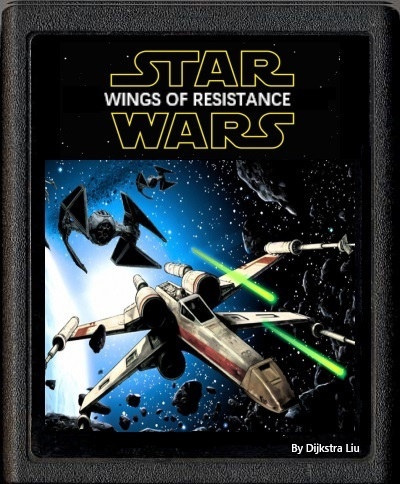
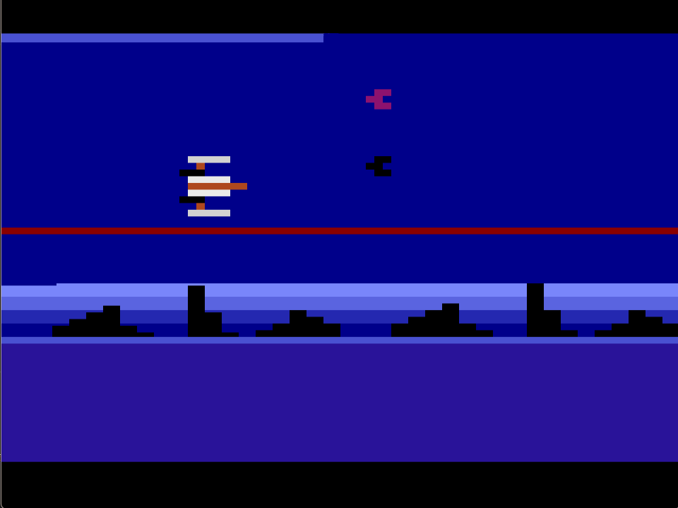

# Star War: Wings of Resistance



Star War: Wings of Resistance is an open source Atari-style game where you assume the role of a Rebel Alliance pilot defending the planet Dykstron from an Imperial onslaught. This project emulates classic Atari aesthetics with retro pixel graphics and fast-paced, strategic gameplay.

## Table of Contents

- [Star War: Wings of Resistance](#star-war-wings-of-resistance)
  - [Table of Contents](#table-of-contents)
  - [Overview](#overview)
  - [Features](#features)
  - [Installation](#installation)
  - [Gameplay](#gameplay)
    - [Game Mechanics](#game-mechanics)
    - [Controls](#controls)
    - [Scoring System](#scoring-system)
  - [Technical Details](#technical-details)
  - [Contributing](#contributing)
  - [Additional Information](#additional-information)

## Overview

In this game, you pilot an X-Wing fighter to protect your Rebel base on the planet Dykstron. Your mission is to locate and destroy the enemy Core Ship, which holds an energy field shielding other enemy fighters. Destroying the Core Ship causes a chain reaction that eliminates nearby enemies. Manage your energy wisely to activate an Invincible State, a temporary mode that lets you clear enemy waves with a spinning gravitational field.



## Features

- **Atari-Style Graphics:** Retro, pixelated visuals inspired by classic Atari games.
- **Dynamic Gameplay:** Battle through waves of enemy fighters with varying attack patterns.
- **Energy Mechanics:** Collect energy to trigger an Invincible State that provides temporary immunity and powerful attacks.
- **Adaptive Difficulty:** Features a day & night cycle to increase challenge and variety during gameplay.
- **Console Controls:** Easily restart and manage the game using dedicated console buttons.

## Installation

1. goto <https://dasm-assembler.github.io/> to download the DASM assembler
2. clone the repository ```git clone https://github.com/TJor-L/Wing-of-Resistance.git```
3. unpack the donwloaded DASM assembler, move the dasm executable to the root of the repository.
(If you are using Linux, the file in step 3 and 4 are already in the root of the repository)
4. move machines/atari2600/macro.h and machines/atari2600/vcs.h to the root of the repository.
5. try ```dasm wing_of_resistance.asm -f3 -o"wing_of_resistance.bin"``` to compile the game.
6. From <https://stella-emu.github.io/downloads.html>, download the Stella emulator of your system.
7. open the compiled wing_of_resistance.bin with the Stella emulator to play the game.

## Gameplay

### Game Mechanics

- **Mission:** Defend your Rebel base on Dykstron by eliminating enemy forces.
- **Core Ship Targeting:** Identify and destroy the unique Core Ship in each wave to disable the enemy energy shield, triggering a detonation that clears surrounding enemy fighters.
- **Invincible State:** After breaking the energy field, your X-Wing accumulates energy that can be used to enter an Invincible State. In this state, your ship spins rapidly and creates a gravitational field that destroys nearby enemies. Note that this state consumes energy and has an upper limit.

### Controls

- **Movement:** Use the joystick to move your X-Wing (UP/DOWN/LEFT/RIGHT in keyboard).
- **Invincible State Activation:** Press the Fire Button to engage the Invincible State. (SPACE in keyboard)

- **Reset Button:** Start or restart the game at any time (F2 in ketboard).

### Scoring System

At the end of a game, your performance is rewarded with one of the following medals:

- **BRONZE**
- **SILVER**
- **GOLD**
- **SUPER**

## Technical Details

- **Platform:** Built using an Atari-style game engine with retro pixel graphics.
- **Graphics & Audio:** Incorporates vintage graphics and sound effects, including missile launches, laser warnings, and explosions.
- **Input Handling:** Designed for joystick and button controls, ensuring a responsive gaming experience.
- **Game Loop:** Implements a continuous loop for real-time enemy spawning, collision detection, and energy management.
- **Physics:** Basic physics simulation for realistic movement and collision response.

## Contributing

Contributions are welcome! You could submit bug fixes, features, and improvements.

## Additional Information

- **Day & Night Cycle:** The game alternates between day and night, adding variety and increasing the challenge.
- **Energy Bar:** Monitor your energy level to ensure you can activate the Invincible State when needed.
- **Audio Cues:** Listen for laser warnings to anticipate enemy attacks and improve your dodging strategies.

---

Enjoy the game and may the Force be with you!
